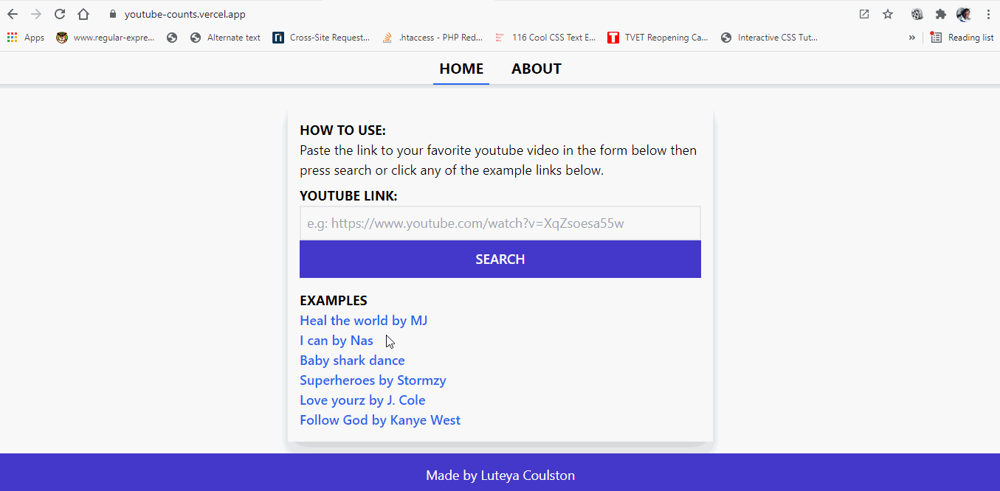

# youtube-counts
Web app for displaying live youtube video views, likes, comments and dislikes counts.



## Requirements
Create a .env file by copying the .env.example file then go to https://developers.google.com to obtain the api key and the other auth tokens.
## Build Setup

```bash
# install dependencies
$ npm install

# serve with hot reload at localhost:3000
$ npm run dev

# build for production and launch server
$ npm run build
$ npm run start

# generate static project
$ npm run generate
```

For detailed explanation on how things work, check out [Nuxt.js docs](https://nuxtjs.org).
